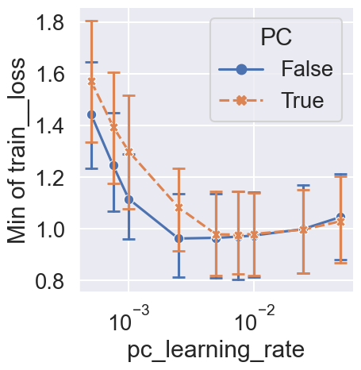

- [Base](#base)

# Base

```bash
# running
python main.py -c nature_teacher_example_122/base
```

```bash
python analysis_v1.py \
-t "train__loss" \
-l "$RESULTS_DIR/nature_teacher_example_122/" \
-m "compress_plot('train__loss', 'training_iteration')" \
-f "./experiments/nature_teacher_example_122/base.yaml" \
-v \
"df=au.extract_plot(df,'train__loss','training_iteration')" \
"au.nature_relplot_curve(data=df, x='training_iteration', y='train__loss', size='pc_learning_rate', size_norm=matplotlib.colors.LogNorm(), hue='PC', style='PC')"
```


```bash
python analysis_v1.py \
-t "train__loss-min" \
-l "$RESULTS_DIR/nature_teacher_example_122/" \
-m "df['train__loss'].min()" \
-f "./experiments/nature_teacher_example_122/base.yaml" \
-v \
"g=au.nature_relplot(data=df, x='pc_learning_rate', y='Min of train__loss', hue='PC', style='PC')" \
"[ax.set_xscale('log') for ax in g.axes.flat]"
```

